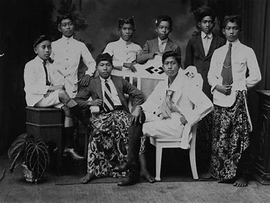
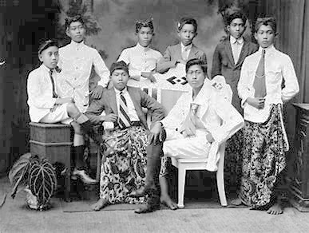

# PixelGG - Aplikasi Restorasi Foto Sejarah

<!--   
  -->


Aplikasi desktop untuk restorasi foto-foto sejarah dengan berbagai operasi pengolahan citra digital. Dibangun dengan Python dan PyQt untuk antarmuka pengguna.

## 📌 Fitur Utama

### 1. Operasi Dasar
- **Grayscale**: Konversi warna ke skala abu-abu
- **Biner**: Thresholding untuk gambar hitam-putih
- **Brightness**: Penyesuaian kecerahan gambar
- **Scale**: Perubahan ukuran gambar (zoom in/out)
- **Rotate**: Rotasi gambar (0-360 derajat)

### 2. Filter & Enhacement
- **Gaussian Blur**: Reduksi noise dengan filter Gaussian
- **Histogram Equalization**: Peningkatan kontras melalui ekualisasi histogram


## 🛠 Teknologi Digunakan
- **Bahasa**: Python 3.9+
- **GUI Framework**: PyQt5
- **Image Processing**: OpenCV
- **Tambahan**: NumPy, Matplotlib (untuk histogram)

## 📥 Instalasi
1. Clone repository:
   ```bash
   git clone https://github.com/username/PixelGG.git
   cd PixelGG

2. Clone repository:  
   ```bash 
   pip install -r app/req.txt

3. Jalankan aplikasi:  
   ```bash 
   python Main.py

